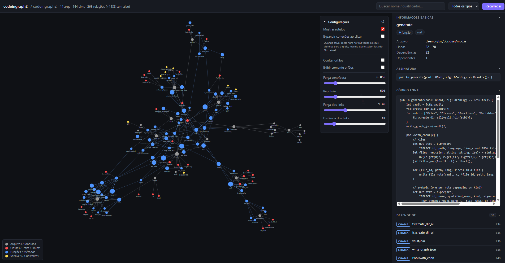

# codeingraph2

Daemon Docker que indexa um repositório em um grafo SQLite e o expõe via MCP para que o Claude Code puxe **contexto cirúrgico** — apenas os trechos exatos que importam — antes de qualquer refatoração.

[Read in English](README_EN.md)

## UI Web



> Grafo interativo com zoom automático, destaque multi-seleção por tipo de símbolo, busca com dropdown e painel lateral com código-fonte ao clicar em qualquer nó ou aresta.

## O que gera

| Saída | Descrição |
|---|---|
| Servidor MCP global (`mcp_server`) | 8 ferramentas de navegação eficiente em tokens |
| Viewer web | Grafo Cytoscape na porta escolhida (Basic Auth) |
| `CLAUDE.md` | Injetado automaticamente no projeto-alvo para guiar o Claude |
| Vault Obsidian | Mapa visual colorido (opcional, `--no-vault` para desativar) |

## Multi-projeto

Um único servidor MCP global (`codeingraph2`) cobre todos os projetos instalados. Cada projeto tem seu próprio container daemon independente. O parâmetro `"project"` roteia as chamadas para o banco de dados correto:

```json
{ "tool": "graph_stats", "arguments": { "project": "meu-projeto" } }
```

Use `list_projects` para descobrir os projetos disponíveis.

## Instalação rápida

```bash /install_dir/codeingraph2/install_global.sh   --target /install_dir/my-project   --name my-project   --port 1234```

O script:
1. Cria `projects/meu-projeto/` com o `.env` do container
2. Constrói a imagem e sobe o daemon (`meu-projeto_container`)
3. Inicia (ou reutiliza) o container MCP global `codeingraph2_mcp`
4. Registra a entrada `codeingraph2` em `~/.mcp.json` e `~/.claude.json`

Instalar um segundo projeto não cria uma nova entrada MCP — apenas atualiza o `registry.json`:

```bash
./install_global.sh --target /outro/repo --name outro-projeto --port 7891
```

Modo não-interativo (para scripts):

```bash
./install_global.sh \
  --target /caminho/do/repo --name meu-projeto \
  --port 7890 --user admin --pass 'segredo!' \
  --non-interactive
```

## Estrutura de diretórios

```
codeingraph2/
├── docker-compose.yml        # daemon por projeto
├── mcp-compose.yml           # container MCP global persistente
├── install_global.sh         # instalador / gerenciador de projetos
├── registry.json             # gerado automaticamente (não commitado)
├── daemon/src/               # código Rust
│
└── projects/                 # dados por projeto (não commitado)
    └── meu-projeto/
        ├── .env
        ├── graph.db
        └── obsidian_vault/
```

O diretório `projects/` e o `registry.json` ficam no `.gitignore`.

## Flags do install_global.sh

| Flag | Padrão | Descrição |
|---|---|---|
| `--target PATH` | `./target_code` | Diretório a indexar |
| `--name NAME` | basename do `--target` | Nome da instância |
| `--port N` | pergunta | Porta da UI web |
| `--user NAME` | pergunta | Usuário da UI web |
| `--pass SECRET` | pergunta | Senha da UI (mín. 6 chars) |
| `--no-web` | — | Desativa a UI web |
| `--no-vault` | — | Desativa a geração do vault Obsidian |
| `--no-build` | — | Pula `docker compose build` |
| `--no-start` | — | Pula `docker compose up` |
| `--non-interactive` | — | Nunca faz prompt (requer `--pass`) |
| `--uninstall` | — | Para o container e remove do registry |

## Subcomandos do daemon

```bash
docker exec meu-projeto_container codeingraph2 daemon     # watcher + indexer + UI web
docker exec meu-projeto_container codeingraph2 index      # reindexação completa (one-shot)
docker exec meu-projeto_container codeingraph2 vault      # regenera vault Obsidian
docker exec meu-projeto_container codeingraph2 claudemd   # regenera CLAUDE.md
docker exec meu-projeto_container codeingraph2 web        # apenas a UI web
docker exec meu-projeto_container codeingraph2 stats      # estatísticas JSON do grafo
docker exec meu-projeto_container codeingraph2 health     # exit 0 se saudável
```

## Ferramentas MCP

Todas aceitam o parâmetro opcional `"project"` para selecionar o projeto.

| Ferramenta | Descrição |
|---|---|
| `list_projects` | Lista todos os projetos registrados |
| `get_surgical_context` | Trechos exatos de código impactados por um símbolo, com `source` incluso |
| `patch_symbol` | Edita um símbolo pelo nome — sem `Read`, sem `old_string` |
| `query_graph` | Busca por nome / tipo / arquivo — retorna arquivo + número de linha |
| `get_symbol` | Metadados completos: assinatura, arquivo, linhas exatas, docstring |
| `get_callers` | Quem chama o símbolo X (transitivo, até profundidade N) |
| `get_callees` | O que o símbolo X chama |
| `graph_stats` | Contagens globais (arquivos, símbolos, relações) |

## Fluxo recomendado com o Claude

```jsonc
// 1. Antes de refatorar: obtenha o contexto cirúrgico
{ "tool": "get_surgical_context", "arguments": { "symbol": "minha_funcao", "depth": 1 } }
// → retorna source completo do símbolo e de todos os callers

// 2. Edite diretamente pelo nome — sem old_string
{ "tool": "patch_symbol", "arguments": { "symbol": "minha_funcao", "new_source": "..." } }
// O daemon reindexará automaticamente na próxima janela do watcher
```

## Linguagens suportadas

Rust, Python, JavaScript, TypeScript.

Para adicionar uma linguagem: inclua uma entrada em [`daemon/src/indexer/languages.rs`](daemon/src/indexer/languages.rs) com a `Language` do tree-sitter e os mapeamentos de `symbol_nodes` / `relation_nodes`.

## Estrutura do repositório

```
.
├── Dockerfile                    # build multi-stage Rust
├── docker-compose.yml            # daemon por projeto
├── mcp-compose.yml               # container MCP global persistente
├── install_global.sh             # instalador / gerenciador de projetos
├── Architecture.md               # arquitetura detalhada
├── templates/CLAUDE.md.tmpl      # template injetado no projeto-alvo
└── daemon/src/
    ├── main.rs                   # entry point CLI (subcomandos clap)
    ├── bin/mcp_server.rs         # servidor MCP stdio (JSON-RPC 2.0)
    ├── config.rs                 # configuração via variáveis de ambiente
    ├── db.rs                     # pool SQLite + migrations
    ├── indexer/                  # walker + specs tree-sitter por linguagem
    ├── watcher.rs                # inotify + debounce + supressão de loops
    ├── impact.rs                 # scores fan-in / fan-out / centralidade
    ├── obsidian/mod.rs           # gerador do vault (opcional)
    ├── claudemd/mod.rs           # renderer do CLAUDE.md (idempotente)
    └── web/                      # servidor HTTP axum + Basic Auth
```

## Paleta de cores do grafo

| Tipo | Cor |
|---|---|
| Files / Modules | `#999999` cinza |
| Classes / Traits / Enums | `#ff4d4d` vermelho |
| Functions / Methods | `#4d94ff` azul |
| Variables / Constants | `#ffdb4d` amarelo |
